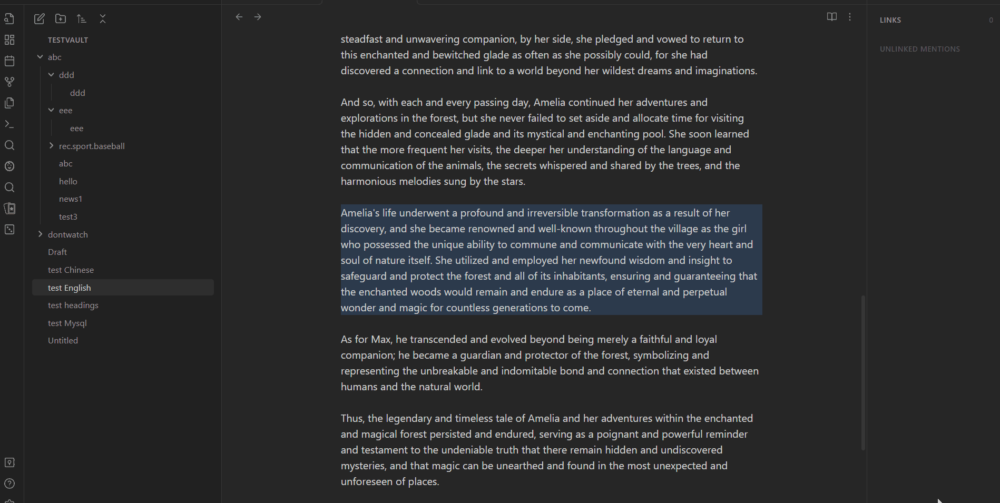

# Obsidian Clever Search

> 少按几键，速寻心间所记

[English Doc](README.md)

## 演示

### 实时高亮和预览

### 隐私模式

## 功能

### 主要功能

- [x] 在资料库中进行语义搜索
- [x] 在资料库中进行模糊搜索
- [x] 在当前笔记中模糊搜索
- [x] 实时高亮和精确跳转到目标位置
- [x] 切换隐私模式（仅编辑模式）
- [ ] 补全提示
- [ ] 持久的搜索历史

### 细微调整以提升用户体验

- [x] 搜索选中文本
- [x] 自动复制选中的结果文本
- [ ] 记住上次查询文本

### 集成其他插件

- [x] `Style Settings`
- [x] `Omnisearch`
    

详情

        新命令： "Search in file with last Omnisearch query Omnisearch"  
        使用场景： 
            当你通过 Omnisearch 确认一个全库搜索并且认为当前文件中可能还有更多未被 Omnisearch 列出的匹配文本时，触发这个命令将打开一个文件内搜索模态框，并且用 Omnisearch 的最后一次查询填充搜索栏。  
        注意： 这只是为更好的全库搜索提供一个临时解决方案，我将在未来实现功能更完善的全库搜索, 并且不依赖于Omnisearch
    

## 可用命令

| 范围     | 名称                 | 热键                      |
| -------- | -------------------- | ------------------------- |
| 匹配项     | 查看上下文       | `左键点击`                |
| 模态框   | 下一项           | `Ctrl-J`                  |
| 模态框   | 上一项           | `Ctrl-K`                  |
| 模态框    | 下一子项 (全库搜索)          | `Ctrl-N`                 |
| 模态框    | 上一子项          | `Ctrl-P`                 |
| 模态框   | 确认项             | `Enter` 或 `右键点击`    |
| 模态框    | 切换语义 / 词汇搜索          | `Ctrl-S`                 |
| Obsidian | 在资料库搜索 (语义)         | 未定义                    |
| Obsidian | 在资料库搜索 (词汇)         | 未定义                    |
| Obsidian | 在文件中搜索         | 未定义                    |
| Obsidian | 在文件中搜索，并使用Omnisearch的上次搜索文本 (纪念对本项目的启发) | 未定义 |
| Obsidian | 切换隐私模式         | 未定义                    |

## 局限

如果一个文件字数超过50万，文件内搜索可能比较慢，不过全库搜索没有这样的性能局限

## 安装

- 通过 [BRAT](https://github.com/TfTHacker/obsidian42-brat) 安装，并且开启`自动更新`选项获取本插件最新的功能
- 手动安装：
    1. 从[最新发布版](https://github.com/yan42685/obsidian-clever-search/releases)下载最新的 `main.js`, `style.css`和 `manifest.json`
    2. 在你的资料库位置的 `.obsidian/plugins` 中创建一个名为`clever-search`的文件夹
    3. 将上述文件移动到你创建的文件夹中
    4. 在 `设置 - 社区插件 - 已安装的插件` 中点击 `重新加载插件` 并启用 `Clever Search`

## [常见疑问](https://github.com/yan42685/obsidian-clever-search/wiki/Home-%E2%80%90-zh#%E5%B8%B8%E8%A7%81%E7%96%91%E9%97%AE)

## 声明

根据 Obsidian 开发者政策的要求，在此声明本插件从网络下载了必要的程序资源至 `userData` 目录。您可以在插件设置中查看这些资源的具体存放路径。

## 支持此项目

如果这个插件对你有用，希望能点个star⭐，或者更进一步支持...
