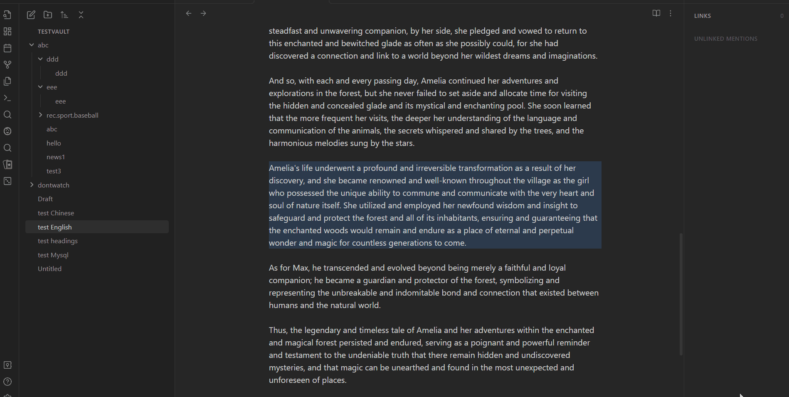

# Obsidian Clever Search

> 少按几键，速寻心间所记

[English Doc](README.md)

## 0.3 新增内容

0.3 版带来了一次完整的搜索能力升级：词法引擎、混合搜索、搜索历史和 Quick 系列入口都进行了更新，让 Clever Search 更快、更宽容，也更适合反复搜索。

- 词法引擎升级：由自研 Coverage Lexical 全面替代 MiniSearch，搜索结果更符合直觉
- 混合全库搜索：词法向量混合搜索已取代 Semantic Search，作为跨语言、近义词、同义词场景下对词法引擎的补全；当混合路径不可用时，会平滑回退到纯词法搜索结果
- 搜索历史自动补全：只记录已确认的查询，并在输入时用于模糊排序候选、顶部历史幽灵补全和匹配字符强调
- 搜索历史控制：可以启用或禁用历史，设置最大历史数量，在设置中清空历史，也可以直接从候选列表移除单条记录
- 更清爽的重复搜索流程：历史建议支持鼠标选择、键盘导航、`Ctrl+R` 手动切换、`Tab` 接受幽灵补全、`Delete` 或 `x` 移除，以及按 Enter 确认，同时不改变结果排序逻辑
- 新增 QuickSwitch 和 QuickCommand：会持久化搜索历史，并记住你经常确认项的偏好

## 演示

### 实时高亮和预览

### 隐私模式

## 功能

### 主要功能

- [x] 在资料库中进行混合搜索（词法 + 向量，支持回退）
- [x] 在资料库中进行语义搜索（仅支持 Windows）
- [x] 在资料库中进行模糊搜索
- [x] 在当前笔记中模糊搜索
- [x] 实时高亮和精确跳转到目标位置
- [x] 切换隐私模式（仅编辑模式）
- [x] 搜索历史自动补全
- [x] 持久的搜索历史

### 细微调整以提升用户体验

- [x] 搜索选中文本
- [x] 自动复制选中的结果文本
- [x] 搜索指令（仅支持 in-vault lexical search）  
    可以通过在搜索栏中使用命令临时更改搜索选项。这些命令优先于设置选项卡中的设置，必须位于输入的开头或末尾，并且与搜索文本之间用空格分隔。

    命令不能放置在搜索文本中间；可以任意组合命令，例如 `/ap/nf something /np`。后面的命令会覆盖相同类型的早期命令（例如 `/np` 会覆盖 `/ap`）。

		/ap  allow prefix matching
		/np  no prefix matching
		/af  allow fuzziness
		/nf  no fuzziness

### 集成其他插件

- [x] `Style Settings`

## 可用命令

| 范围     | 名称                 | 热键                      |
| -------- | -------------------- | ------------------------- |
| 匹配项     | 查看上下文       | `左键点击`                |
| 模态框   | 下一项           | `Ctrl-J`                  |
| 模态框   | 上一项           | `Ctrl-K`                  |
| 模态框    | 下一子项 (全库搜索)          | `Ctrl-N`                 |
| 模态框    | 上一子项          | `Ctrl-P`                 |
| 模态框    | 确认项                                                       | `Enter` / `Right Click` / `Double Click` |
| 模态框 | 在后台确认项 | `Ctrl` + `Enter` / `Right Click` / `Double Click` |
| 模态框    | 切换混合 / 词法搜索          | `Ctrl-S`                 |
| 模态框    | 插入文件链接                                                    | `Alt-I`                 |
| Obsidian | 在资料库搜索 (混合)         | 未定义                    |
| Obsidian | 在资料库搜索 (词法)         | 未定义                    |
| Obsidian | 在文件中搜索         | 未定义                    |
| Obsidian | 切换隐私模式         | 未定义                    |

## 安装

- 通过 [BRAT](https://github.com/TfTHacker/obsidian42-brat) 安装，并且开启`自动更新`选项获取本插件最新的功能
- 手动安装：
    1. 从[最新发布版](https://github.com/yan42685/obsidian-clever-search/releases)下载最新的 `main.js`, `style.css`和 `manifest.json`
    2. 在你的资料库位置的 `.obsidian/plugins` 中创建一个名为`clever-search`的文件夹
    3. 将上述文件移动到你创建的文件夹中
    4. 在 `设置 - 社区插件 - 已安装的插件` 中点击 `重新加载插件` 并启用 `Clever Search`

## [常见疑问](https://github.com/yan42685/obsidian-clever-search/wiki/Home-%E2%80%90-zh#%E5%B8%B8%E8%A7%81%E7%96%91%E9%97%AE)

## 声明

根据 Obsidian 开发者政策的要求，在此声明本插件从网络下载了必要的程序资源至 `userData` 目录。您可以在插件设置中查看这些资源的具体存放路径。

## 支持此项目

如果这个插件对你有用，希望能点个 star⭐，或者更进一步支持...

> 感谢 @Moyf 对本项目的打赏支持
