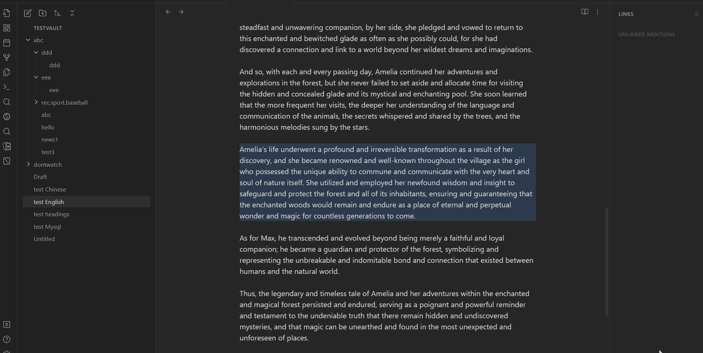

# Obsidian Clever Search

> Enjoy swift access to your notes with minimal key presses

[中文文档](README-ZH.md) | [English Doc](README.md)

## Demo

### Realtime Search and Preview

### Privacy Mode

## Features

### Major

- [x] Fuzzy search inside current note
- [x] Realtime highlighting and Precise jump to the target location
- [x] Toggle privacy mode (Edit mode only)
- [ ] AutoCompletion
- [ ] Persistent search history
- [ ] Fuzzy search in the vault
- [ ] Semantic search in the vault

### Subtle Tweaks for Better UX

- [x] keep focusing input bar even if clicking an item
- [x] Search from selection
- [ ] Remember last query text

### Integrate with other plugins

- [x] `Style Settings`
- [x] `Omnisearch`
    

Details

        New command: "Search in file with last Omnisearch query"  
        Use case: 
        When you confirm an in-vault search by Omnisearch and think there might be more matched text that are not listed by Omnisearch in current file, trigger this command will open a in-file search modal and fill the search bar with last query in Omnisearch.  
        Note:  this is just a temporary workaround for a better in-vault search. I will implement full-featured in-vault search without dependency on Omnisearch in the future.
    

## Available Commands

| Scope    | Name                | Hotkey                   |
| -------- | ------------------- | ------------------------ |
| Item     | View Item Context   | `Left Click`             |
| Modal    | Next Item           | `Ctrl-J` or `ArrowDown`  |
| Modal    | Previous Item       | `Ctrl-K` or `ArrorUp`    |
| Modal    | Confirm Item        | `Enter` or `Right Click` |
| Obsidian | Search In File      | undefined                |
| Obsidian | Toggle Privacy Mode | undefined                |
| Obsidian | Search in file with last Omnisearch query | undefined |

## Installation

- Install through [BRAT](https://github.com/TfTHacker/obsidian42-brat) and turn on `Auto-update plugins at startup` option to automatically install the latest version when available.
- (Manual) installation:
    1. Download the latest `main.js`, `style.css` and `manifest.json` from the [latest release](https://github.com/yan42685/obsidian-clever-search/releases)
    2. Create a folder named `clever-search` in `.obsidian/plugins` at your vault location
    3. Move above files into the folder you created
    4. click `reload plugins` at `Settings - Community plugins - installed plugins` and enable `Clever Search`

## Support

If this plugin has been useful to you, I'd be sincerely thankful for your star⭐ or donation❤️.

